# N8N MCP Server for Claude.ai and ChatGPT

🚀 Production-ready MCP server that brings N8N workflow automation to both Claude.ai and ChatGPT (via ChatGPT Connectors).

Works over HTTP(S) using SSE or WebSocket and provides an OAuth flow for browsers. SSE mode is compatible with ChatGPT Connectors, and OAuth/SSE modes work with Claude web.

## 📚 Table of Contents

- [🎯 What Makes This Special](#-what-makes-this-special)
- [✨ Features](#-features)  
- [🛠️ Available Tools](#️-available-tools)
- [🚀 Quick Start](#-quick-start)
- [⚙️ Configuration](#️-configuration)
- [🔐 Authentication Flow](#-authentication-flow)
- [🚀 Production Deployment](#-production-deployment)
- [🏗️ Architecture](#️-architecture)
 - [🏗️ Architecture](#️-architecture)
 - [🖥️ Admin Dashboard](#️-admin-dashboard)
- [🔧 Troubleshooting](#-troubleshooting)
- [🤝 Contributing](#-contributing)
- [💬 Support](#-support)

## 🎯 What Makes This Special

- 🌐 **Web-First Design**: Works with Claude.ai web interface (not just desktop)
- 🔬 **Protocol Breakthrough**: Solves Claude.ai's non-standard MCP implementation  
- 🏢 **Multi-Tenant Architecture**: Multiple users, multiple N8N instances
- 🚀 **Production Ready**: Docker deployment with Traefik integration
- 🔓 **Universal Access**: Connect any N8N instance dynamically


*Visual: Claude.ai seamlessly integrated with N8N workflows*

## ✨ Features

- 🔐 **OAuth 2.1 Authentication** - Secure authentication flow for Claude.ai integration
- 🔄 **Dynamic N8N Configuration** - Enter any N8N instance credentials during login
- 📋 **Comprehensive Workflow Management** - Create, read, update, delete, and execute workflows
- ⚡ **Real-time Execution Control** - Start, stop, and monitor workflow executions
- 👥 **Multi-tenant Support** - Each user session maintains separate N8N credentials
- 🐳 **Docker Ready** - Containerized deployment with Traefik integration
- 🔌 **WebSocket Transport** - Native WS endpoint for ChatGPT Connectors
- 🌊 **SSE Transport** - SSE endpoint compatible with ChatGPT Connectors
 - 🖥️ **Admin Dashboard** - Manage multiple N8N API hosts (add/remove, test, set defaults)

## 🧩 ChatGPT Connector (SSE)

For ChatGPT Connectors, run the SSE server variant and restrict CORS to ChatGPT domains.

Environment (Docker or compose):

```
MCP_MODE=sse
PORT=3004
# Allow ChatGPT + your domain(s)
CORS_ORIGIN=https://chat.openai.com,https://chatgpt.com,https://n8n-mcp.right-api.com
# Optional: Preconfigure N8N (SSE also supports setting via tool or query params)
N8N_HOST=https://your-n8n.example.com
N8N_API_KEY=your-n8n-api-key
```

Endpoints:
- GET SSE stream: `GET /sse` with `Accept: text/event-stream`
- Send messages: `POST /sse/message` (or `/message`) with `sessionId`

Notes:
- Set `CORS_ORIGIN` to a comma-separated allowlist. Use the exact origins ChatGPT uses (currently `https://chat.openai.com` and/or `https://chatgpt.com`).
- The server persists `N8N_HOST`/`N8N_API_KEY` under `/app/data/n8n-credentials.json` when set via the `set_n8n_credentials` tool or SSE `?n8n_host=&n8n_key=` query.

### 🔐 OAuth Mode (ChatGPT Connector)

For a production ChatGPT Connector run the OAuth flavour (`MCP_MODE=oauth`). This exposes the same SSE endpoint at `/mcp`, but requires the user to sign in before a session is created.

Environment highlights:

```
MCP_MODE=oauth
PORT=3007                 # Default OAuth port
SERVER_URL=https://mcp.example.com  # Optional public base URL for discovery
ADMIN_USERNAME=admin       # Change these in production
ADMIN_PASSWORD=changeme
```

Workflow:
1. Start the server and visit `https://your-server/admin` to sign in. Add one or more n8n hosts (URL + API key) and choose a default.
2. ChatGPT Connector hits `/.well-known/openid-configuration` and completes OAuth against `/oauth/authorize` and `/oauth/token`.
3. After login the issued access token stores the selected `host_id` (or the admin-set default). The ChatGPT client connects to `GET /mcp` with `Accept: text/event-stream` and reuses the returned `host_id` for future calls.
4. Additional hosts can be targeted per request with a query such as `/mcp?host_id=h2`.

Endpoints exposed in OAuth mode:
- GET `/.well-known/openid-configuration` – discovery document
- GET `/oauth/authorize` – handles the login + consent flow
- POST `/oauth/token` – issues access tokens (PKCE supported)
- GET `/mcp` – SSE stream (requires `Authorization: Bearer <token>`)
- POST `/mcp/message` – send JSON-RPC messages (requires `mcp-session-id`)
- DELETE `/mcp/session` – close a session

> ℹ️ Environment variables `N8N_HOST`/`N8N_API_KEY` still work as a fallback host when no admin-configured hosts exist.

### 🔎 Quick Curl Test (SSE)

1) Start the SSE server (compose or `MCP_MODE=sse PORT=3004`).

2) In one terminal, open the SSE stream and note the session id from the first event lines (look for `id:`):

```
curl -N -H "Accept: text/event-stream" \
  https://n8n-mcp.right-api.com/sse
```

3) In another terminal, post a JSON-RPC request to list tools. Replace SESSION_ID with the id captured from step 2:

```
curl -X POST \
  -H "Content-Type: application/json" \
  -H "mcp-session-id: SESSION_ID" \
  -d '{
    "jsonrpc":"2.0",
    "id":"1",
    "method":"tools/list"
  }' \
  https://n8n-mcp.right-api.com/sse/message
```

You should receive a JSON-RPC result with the available tools. You can then call a tool, e.g.:

```
curl -X POST \
  -H "Content-Type: application/json" \
  -H "mcp-session-id: SESSION_ID" \
  -d '{
    "jsonrpc":"2.0",
    "id":"2",
    "method":"tools/call",
    "params": {"name":"get_n8n_status","arguments":{}}
  }' \
  https://n8n-mcp.right-api.com/sse/message
```

## 🛠️ Available Tools

The MCP server provides 9 N8N tools for workflow automation:

### 📋 Workflow Management
- 📝 `get_workflows` - List all workflows
- 🔍 `get_workflow` - Get specific workflow details
- ➕ `create_workflow` - Create new workflows
- ✏️ `update_workflow` - Update existing workflows
- 🗑️ `delete_workflow` - Delete workflows
- ▶️ `activate_workflow` - Activate workflows
- ⏸️ `deactivate_workflow` - Deactivate workflows

### ⚡ Execution Management
- 🚀 `execute_workflow` - Execute workflows manually
- 📊 `get_executions` - View execution history and status

## 🚀 Quick Start

> 📸 **Complete visual guide with real screenshots of the integration process**


*Screenshot: Claude.ai successfully managing N8N workflows*

### 1️⃣ Clone and Setup

```bash
git clone https://github.com/yourusername/n8nmcp.git
cd n8nmcp
cp .env.example .env
```

### 2️⃣ Configure Environment

Edit `.env` file with your settings:
```bash
# Required
ADMIN_USERNAME=admin
ADMIN_PASSWORD=your-secure-password
SERVER_URL=https://your-domain.com
# Allow Claude and/or ChatGPT
CORS_ORIGIN=https://claude.ai,https://chat.openai.com,https://chatgpt.com

# Optional (can be set via login form)
N8N_HOST=https://your-n8n-instance.com
N8N_API_KEY=your-n8n-api-key
```

### 3️⃣ Deploy with Docker

```bash
# Make sure you're in the n8nmcp directory
docker-compose up -d

# Check logs
docker logs n8n-mcp-server -f
```

### 4️⃣ Alternative: Quick Deploy with Cloudflare Tunnel

For instant HTTPS access without domain setup:

```bash
# Install Cloudflare Tunnel
curl -L --output cloudflared.deb https://github.com/cloudflare/cloudflared/releases/latest/download/cloudflared-linux-amd64.deb
sudo dpkg -i cloudflared.deb

# Start the N8N MCP server locally
docker run -d --name n8n-mcp-server -p 3005:3000 \
  -e ADMIN_USERNAME=admin \
  -e ADMIN_PASSWORD=your-secure-password \
  -e CORS_ORIGIN="https://claude.ai,https://chat.openai.com,https://chatgpt.com" \
  your-built-image

# Create instant HTTPS tunnel
cloudflared tunnel --url http://localhost:3005
```

This creates a public HTTPS URL like:
```
https://random-words-generated.trycloudflare.com
```

Use this URL for Claude.ai integration - the server auto-detects the domain!

### 5️⃣ Integrate with Claude.ai


*Screenshot: Adding MCP integration in Claude.ai Settings*

1. **Open Claude.ai** → Settings → Integrations
2. **Add Custom Integration**:
   
   
   *Screenshot: MCP server configuration form*
   
   - Name: `N8N Workflow Manager`
   - URL: `https://your-domain.com/` or `https://your-tunnel.trycloudflare.com/`
   - Type: `MCP Server`

3. **OAuth Authorization**: Login with admin credentials
   
   
   *Screenshot: OAuth authorization page with admin login*

4. **Connect N8N**: Enter your N8N instance URL and API key
   
   
   *Screenshot: N8N credentials form*

5. **Authorization Success**:
   
   
   *Screenshot: Successful authorization*

6. **Integration Connected**:
   
   
   *Screenshot: MCP integration showing as connected*

### 5️⃣ First Test


*Screenshot: Claude.ai showing available N8N tools*


*Screenshot: Claude.ai displaying N8N workflows*

```
Ask Claude: "What MCP tools do you have available?"
Ask Claude: "Can you list my N8N workflows?"
```

## ⚙️ Configuration

### 🔧 Environment Variables

| Variable | Description | Required |
|----------|-------------|----------|
| `PORT` | Server port (default: 3007) | No |
| `HOST` | Server host (default: 0.0.0.0) | No |
| `SERVER_URL` | Override server URL for OAuth endpoints | No** |
| `ADMIN_USERNAME` | Admin login username | Yes |
| `ADMIN_PASSWORD` | Admin password hash | Yes |
| `N8N_HOST` | Default N8N instance URL | No* |
| `N8N_API_KEY` | Default N8N API key | No* |
| `CORS_ORIGIN` | Comma-separated list of allowed origins (e.g. `https://claude.ai,https://chat.openai.com,https://chatgpt.com`) | Yes |

*N8N credentials can be provided via environment variables as fallback or entered dynamically during login.

**Server URL auto-detects from request headers (works with Cloudflare tunnels, ngrok, custom domains)

### 🐳 Docker Compose

The included `docker-compose.yml` provides:
- N8N MCP Server container
- Traefik reverse proxy integration
- Automatic SSL certificates
- Health checks

## 🔌 ChatGPT Connector (WebSocket)

ChatGPT Connectors work best over WebSocket. This repo now exposes a native WS endpoint:

- WS endpoint: `wss://n8n-mcp.right-api.com/ws`
- Health: `http://<your-host>/health`
- Default port: `3006` (configurable via `PORT`)

Steps:
- Deploy the WS server: `node mcp-ws-server.js` (or bake into your container entrypoint)
- In ChatGPT → Connectors → Add custom MCP server, use `wss://n8n-mcp.right-api.com/ws`
- Set `N8N_HOST` and `N8N_API_KEY` in the container env so tools can call your n8n instance

Notes:
- If you are behind a reverse proxy (Traefik), ensure WebSocket upgrade is enabled for the `/ws` path.
- For production, prefer `wss://` with TLS termination at your proxy.
- HTTP→HTTPS redirect is configured for host `n8n-mcp.right-api.com`.

### Traefik example (labels)

Labels used in docker-compose.standalone.yml:

- `traefik.http.routers.n8n-mcp-ws.rule=Host(\`n8n-mcp.right-api.com\`) && PathPrefix(\`/ws\`)`
- `traefik.http.services.n8n-mcp-ws.loadbalancer.server.port=3006`
- Optional headers to force upgrade:
  - `traefik.http.middlewares.n8n-mcp-ws-headers.headers.customrequestheaders.Upgrade=websocket`
  - `traefik.http.middlewares.n8n-mcp-ws-headers.headers.customrequestheaders.Connection=Upgrade`

SSE and OAuth endpoints share the same host with paths:
- SSE: `https://n8n-mcp.right-api.com/sse`
- OAuth: `https://n8n-mcp.right-api.com/oauth`

## 🧱 Two-Container Setup (WS/SSE + OAuth/Admin)

Run the WS/SSE server and the OAuth/Admin server as separate containers behind the same domain:

- WS/SSE container: serves `/`, `/ws`, `/sse`, `/health` and runs the MCP tools.
- OAuth/Admin container: serves `/oauth/*`, `/.well-known/*`, and `/admin` (dashboard).

With this repo’s `docker-compose.standalone.yml`:
- Start all: `docker compose up -d n8n-mcp-ws n8n-mcp-server n8n-mcp-oauth`
- Or just the admin: `docker compose up -d n8n-mcp-oauth`
- Both share `./data:/app/data` so saved hosts and defaults propagate to WS/SSE.

Traefik routes are pre-set via labels:
- `/ws`, `/health`, `/` → WS container
- `/sse`, `/message` → SSE container
- `/oauth/*`, `/.well-known/*`, `/admin` → OAuth/Admin container

If you run containers manually, copy these label routes, put both containers on the Traefik network, and mount a shared data volume.

## 🔐 Authentication Flow


*Diagram: Complete OAuth 2.1 authentication process*

1. **OAuth Authorization** - Claude.ai redirects to authorization endpoint
2. **Admin Login** - Enter admin credentials and N8N instance details
3. **Consent Page** - Review and approve access permissions
4. **Token Exchange** - OAuth 2.1 PKCE flow completes
5. **Session Management** - Server maintains session with N8N credentials

## 🌐 API Endpoints

| Endpoint | Method | Description |
|----------|--------|-------------|
| `/` | GET/POST | MCP protocol endpoint |
| `/health` | GET | Health check |
| `/oauth/authorize` | GET | OAuth authorization |
| `/oauth/token` | POST | Token exchange |
| `/oauth/login` | POST | Admin authentication |
| `/.well-known/oauth-authorization-server` | GET | OAuth discovery |

## 🛡️ Security Features

- **OAuth 2.1 with PKCE** - Modern authentication standard
- **Session Isolation** - Each user session maintains separate credentials
- **Secure Credential Storage** - N8N credentials stored per-session, not globally
- **CORS Protection** - Configurable origin restrictions
- **Environment Variable Protection** - Sensitive data via environment variables

## 💻 Development

### 🏠 Local Development

```bash
npm install
npm start
```

### 🧪 Testing

```bash
# Test MCP tools directly
curl -X POST http://localhost:3007/ \
  -H "Content-Type: application/json" \
  -H "Authorization: Bearer your-token" \
  -d '{"jsonrpc":"2.0","id":1,"method":"tools/list","params":{}}'
```

## 🚀 Production Deployment


*Diagram: Production deployment with Traefik, Docker, and SSL*

### 📋 Prerequisites

- Domain name with DNS pointing to your server
- Docker and Docker Compose installed
- Traefik proxy running (or configure your own reverse proxy)

### 📝 Step-by-Step Deployment

1. **Server Setup**
```bash
# Clone to your server
git clone https://github.com/yourusername/n8nmcp.git
cd n8nmcp

# Configure environment
cp .env.example .env
nano .env  # Edit with your settings
```

2. **Environment Configuration**
```bash
# Generate secure password hash
node -e "console.log(require('crypto').createHash('sha256').update('your-password').digest('hex'))"

# Update .env file
SERVER_URL=https://your-domain.com
ADMIN_USERNAME=admin
ADMIN_PASSWORD=generated-hash-above
CORS_ORIGIN=https://claude.ai
```

3. **Deploy with Docker**
```bash
# Add to existing docker-compose.yml or create new one
docker-compose up -d

# Verify deployment
docker ps | grep n8n-mcp
docker logs n8n-mcp-server
```

4. **SSL/Domain Setup** (if using Traefik)
```yaml
# Already configured in docker-compose.yml
labels:
  - "traefik.enable=true"
  - "traefik.http.routers.n8n-mcp.rule=Host(`your-domain.com`)"
  - "traefik.http.routers.n8n-mcp.entrypoints=websecure"
  - "traefik.http.routers.n8n-mcp.tls.certresolver=mytlschallenge"
```

5. **Test Deployment**
```bash
# Health check
curl https://your-domain.com/health

# OAuth discovery
curl https://your-domain.com/.well-known/oauth-authorization-server
```

## 🏗️ Architecture & Diagrams

Quick diagram references (export SVGs to PNG as needed):

- Architecture (SSE/WS/OAuth): `screenshots/architecture-diagram.svg`
- OAuth 2.1 + PKCE (English): `screenshots/oa2-flow-diagram.svg`
- תרשים OAuth 2.1 + PKCE (עברית): `screenshots/oa2-flow-diagram-he.svg`

Tip: Export to PNG with Inkscape for high-DPI posting:
`inkscape screenshots/architecture-diagram.svg --export-type=png --export-filename=screenshots/architecture-diagram.png --export-dpi=192`


*Diagram: Complete system architecture and data flow*

## 🖥️ Admin Dashboard

Password-protected dashboard to centrally manage N8N API hosts and keys:
- Add/remove/update N8N hosts (name, URL, API key)
- Test connectivity and set a default host for the server
- Persists to `/app/data/n8n-hosts.json` and default creds to `/app/data/n8n-credentials.json`
- Route: `https://n8n-mcp.right-api.com/admin` (uses `ADMIN_USERNAME`/`ADMIN_PASSWORD`)

How to enable (docker compose):
- Ensure the OAuth service mounts `./data:/app/data` and Traefik routes `/admin` to it (already configured in `docker-compose.standalone.yml`).
- Start the OAuth service: `docker compose up -d n8n-mcp-oauth`
- Visit `/admin`, login, add your N8N host + API key, and click “Make Default”.

Notes:
- The SSE/WS servers read `/app/data/n8n-credentials.json`, so the default you set in the dashboard is used by tools immediately.
- You can still override via SSE query params (`?n8n_host=&n8n_key=`) or the `set_n8n_credentials` tool.

### Users & Tokens

- Admin login uses environment variables:
  - `ADMIN_USERNAME`, `ADMIN_PASSWORD` (plaintext password; set a strong value).
- A single admin account is supported per OAuth container. Run multiple containers for separate admin creds if needed.
- Programmatic access tokens for integrations:
  - Create tokens in the dashboard under “API Tokens” or via HTTP:
    - Create: `POST /tokens/register` with JSON `{ "description": "string", "scope": "mcp" }`
    - List: `GET /tokens`
    - Revoke: `DELETE /tokens/{raw_token}`
  - All token endpoints require an authenticated admin session (the dashboard uses your session cookie).

```mermaid
graph TD
    A[👤 Claude.ai User] --> B[🔐 OAuth 2.1 Flow]
    B --> C[🖥️ N8N MCP Server]
    C --> D[📊 Session Management]
    D --> E[🔑 Per-User N8N Credentials]
    E --> F[🤖 N8N Instance]
    
    style A fill:#4A90E2
    style B fill:#28A745
    style C fill:#17A2B8
    style D fill:#6F42C1
    style E fill:#FFC107
    style F fill:#DC3545
```




## 🤝 Contributing

1. Fork the repository
2. Create a feature branch
3. Make your changes
4. Add tests
5. Submit a pull request

## 🔧 Troubleshooting


*Screenshot: Debug console showing MCP protocol messages*

### ⚠️ Common Issues

**🚫 Tools not appearing in Claude.ai**
```bash
# Check authentication
docker logs n8n-mcp-server | grep "AUTH"

# Verify OAuth flow
curl https://your-domain.com/.well-known/oauth-authorization-server

# Test tool discovery
docker logs n8n-mcp-server | grep "tools/list"
```

**⏱️ Connection timeouts**
```bash
# Check server connectivity
curl -I https://your-domain.com/health

# Verify SSL certificate
openssl s_client -connect your-domain.com:443 -servername your-domain.com

# Check Docker networking
docker network ls
docker logs traefik | grep your-domain.com
```

**🔑 N8N API errors**
```bash
# Test N8N connectivity directly
curl -H "Authorization: Bearer your-api-key" https://your-n8n.com/api/v1/workflows

# Check API key permissions in N8N settings
# Verify N8N instance is accessible from Docker network
```

**🔧 Response size issues**
- Large workflow lists may cause timeouts
- Server automatically truncates responses to prevent this
- Check logs for "Response truncated" messages

### 🐛 Debug Commands

```bash
# Complete server logs
docker logs n8n-mcp-server -f

# Filter for errors only
docker logs n8n-mcp-server 2>&1 | grep -E "(ERROR|error|Error)"

# Check authentication flow
docker logs n8n-mcp-server 2>&1 | grep -E "(oauth|auth|session)"

# Monitor MCP protocol
docker logs n8n-mcp-server 2>&1 | grep -E "(MCP|tools|prompts)"
```

### 🆘 Getting Help

If you're still having issues:

1. **Check GitHub Issues**: Look for similar problems
2. **Enable Debug Logging**: Set `DEBUG=true` in environment
3. **Share Logs**: Include relevant log snippets (remove sensitive data)
4. **Describe Setup**: OS, Docker version, domain configuration

## 📄 License

MIT License - see LICENSE file for details

## 🏗️ Advanced Features & Enhancements

### 🔧 Recent Improvements
- **Enterprise-Grade Architecture**: Production-ready with comprehensive error handling
- **Multi-Authentication Support**: JWT, OAuth2, and Access Token strategies
- **Advanced Security**: Rate limiting, input validation, audit logging
- **Real-time Monitoring**: SSE streaming with heartbeat and client management
- **Resilient N8N Integration**: Circuit breaker pattern and retry logic
- **Performance Optimizations**: Response caching and connection pooling

### 🚀 Upcoming Features
- **Workflow Templates**: Pre-built automation patterns
- **Multi-Instance Support**: Connect multiple N8N instances
- **Advanced Analytics**: Usage metrics and performance insights
- **Real-time Collaboration**: Multiple users managing workflows
- **Enhanced Monitoring**: Comprehensive health checks and observability

### 📋 Architecture Excellence
- **Type Safety**: Full TypeScript implementation with strict typing
- **Modular Design**: Clean separation of concerns and dependency injection
- **Scalable Streaming**: Efficient SSE implementation with client management
- **Security First**: Multi-layer security with OAuth 2.1 and input validation
- **Production Ready**: Docker deployment with health checks and monitoring

## 💬 Support


*We're here to help! Open an issue for support.*

- GitHub Issues: Report bugs and feature requests
- Documentation: See docs/ directory
- Examples: See examples/ directory

---

**🎯 This implementation represents the most advanced n8n-MCP integration available, specifically optimized for Claude.ai web interface compatibility.**
