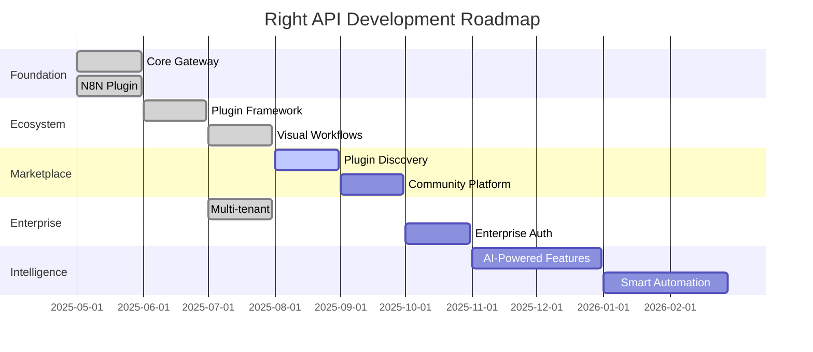
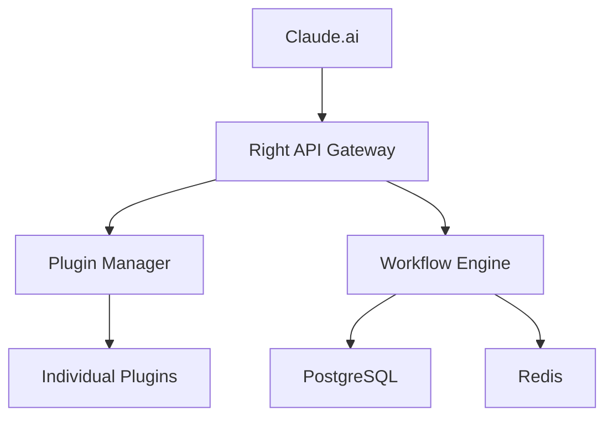
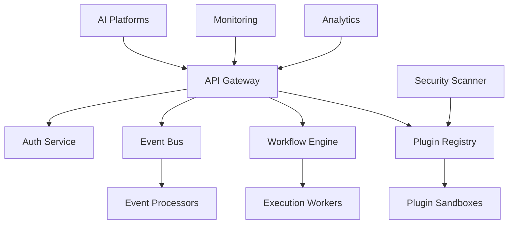

# 🗺️ Right API - Product Roadmap

Welcome to the Right API roadmap! This document outlines our vision and planned development for the universal MCP gateway platform.

## 🎯 Vision Statement

**"To become the npm for MCP backends - making AI integrations as simple as installing a package"**

We're building the foundational infrastructure that will power the next generation of AI applications by solving the core problems in MCP adoption: complexity, security, and ecosystem fragmentation.

---

## 📅 Release Timeline



---

## 🚀 Quarterly Roadmap

### Q3 2025 - Plugin Ecosystem & Marketplace

**Theme: "Building the MCP Ecosystem"**

#### 🎯 Key Objectives
- Launch the first MCP plugin marketplace
- Enable community-driven plugin development
- Establish plugin quality and security standards
- Create revenue sharing for plugin developers

#### 🔌 Plugin Marketplace (August 2025)
**Status: 🔄 In Development**

**Features:**
- **Plugin Discovery** - Search, filter, and browse available plugins
- **One-Click Installation** - `npm install @right-api/plugin-name`
- **Version Management** - Semantic versioning and dependency resolution
- **Rating & Reviews** - Community feedback and plugin quality metrics
- **Documentation Hub** - Centralized docs for all plugins

**Technical Implementation:**
```typescript
// Plugin marketplace API
interface PluginMarketplace {
  search(query: string, filters: PluginFilters): Promise<Plugin[]>;
  install(packageName: string, version?: string): Promise<InstallResult>;
  uninstall(pluginId: string): Promise<void>;
  update(pluginId: string, version?: string): Promise<UpdateResult>;
  getMetrics(pluginId: string): Promise<PluginMetrics>;
}
```

#### 🏪 Community Platform (September 2025)
**Status: 📋 Planned**

**Features:**
- **Developer Portal** - Plugin submission and management
- **Revenue Sharing** - Monetization for plugin developers
- **Quality Assurance** - Automated testing and security scanning
- **Community Forums** - Discussion and support channels

#### 📊 Success Metrics
- **100+ community plugins** in marketplace
- **50+ active plugin developers**
- **10,000+ plugin installations** per month
- **90%+ plugin compatibility** across versions

### Q4 2025 - Enterprise & Compliance

**Theme: "Enterprise-Ready Platform"**

#### 🏢 Enterprise Authentication (October 2025)
**Status: 📋 Planned**

**Features:**
- **SSO Integration** - SAML 2.0, OIDC, and Active Directory
- **Advanced RBAC** - Fine-grained permissions and role management
- **Audit Logging** - Comprehensive compliance trails
- **Data Residency** - Geographic data control and GDPR compliance

#### 🔒 Security & Compliance (November 2025)
**Status: 📋 Planned**

**Features:**
- **SOC 2 Type II** certification
- **Zero-Trust Architecture** implementation
- **Advanced Threat Detection** with AI-powered monitoring
- **Compliance Dashboard** for audit and regulatory requirements

#### 📈 Success Metrics
- **SOC 2 certification** achieved
- **50+ enterprise customers** onboarded
- **99.9% uptime** SLA compliance
- **Zero security incidents** in production

### Q1 2026 - AI-Powered Intelligence

**Theme: "Intelligent Automation"**

#### 🤖 AI-Powered Workflow Builder (January 2026)
**Status: 💭 Conceptual**

**Features:**
- **Natural Language Workflows** - "Send me a Slack alert when GitHub issues are labeled 'critical'"
- **Intelligent Suggestions** - AI-powered workflow optimization recommendations
- **Auto-Error Resolution** - Predictive error handling and auto-recovery
- **Smart Plugin Discovery** - Context-aware plugin recommendations

#### 🧠 Predictive Analytics (February 2026)
**Status: 💭 Conceptual**

**Features:**
- **Performance Prediction** - Forecast workflow bottlenecks
- **Cost Optimization** - Resource usage recommendations
- **Anomaly Detection** - Automated issue identification
- **Capacity Planning** - Intelligent scaling recommendations

---

## 🎯 Strategic Initiatives

### 1. Developer Experience Excellence

**Objective:** Make Right API the easiest way to build MCP integrations

**Key Initiatives:**
- **Zero-Config Deployment** - One-command production setup
- **Hot-Reload Development** - Instant feedback during plugin development
- **Visual Debugging** - Step-through debugging for workflows
- **AI-Powered Documentation** - Auto-generated docs and examples

**Timeline:** Ongoing - Q4 2025

### 2. Global Scale & Performance

**Objective:** Support millions of workflows across global infrastructure

**Key Initiatives:**
- **Multi-Region Deployment** - Global edge presence
- **Microservices Architecture** - Horizontal scalability
- **Event-Driven Processing** - Asynchronous workflow execution
- **Advanced Caching** - Multi-layer performance optimization

**Timeline:** Q1-Q2 2026

### 3. Ecosystem Leadership

**Objective:** Become the de facto standard for MCP integrations

**Key Initiatives:**
- **Open Source Core** - Community-driven development
- **Standards Contribution** - Active participation in MCP specification
- **Partnership Program** - Integration with major AI platforms
- **Developer Advocacy** - Conference talks, tutorials, and content

**Timeline:** Ongoing

---

## 🔌 Plugin Development Roadmap

### Official Plugins (Right API Team)

#### Q3 2025
- ✅ **Slack Plugin** - Complete workspace automation
- ✅ **GitHub Plugin** - Repository and project management
- ✅ **N8N Plugin** - Workflow automation integration
- 🔄 **Discord Plugin** - Community and server management
- 📋 **Notion Plugin** - Knowledge base and project management
- 📋 **Airtable Plugin** - Database and spreadsheet operations

#### Q4 2025
- 📋 **Salesforce Plugin** - CRM and sales automation
- 📋 **HubSpot Plugin** - Marketing and customer management
- 📋 **Jira Plugin** - Issue tracking and project management
- 📋 **Confluence Plugin** - Documentation and collaboration
- 📋 **Trello Plugin** - Task and project organization
- 📋 **Monday.com Plugin** - Work management platform

#### Q1 2026
- 💭 **Microsoft Teams Plugin** - Enterprise communication
- 💭 **Google Workspace Plugin** - Productivity suite integration
- 💭 **Zoom Plugin** - Video conferencing and webinars
- 💭 **Stripe Plugin** - Payment processing and billing
- 💭 **AWS Plugin** - Cloud infrastructure management
- 💭 **Azure Plugin** - Microsoft cloud services

### Community Plugin Priorities

**Most Requested (Community Survey):**
1. **Zapier Plugin** - 5000+ integrations access
2. **Linear Plugin** - Modern issue tracking
3. **Figma Plugin** - Design collaboration
4. **Shopify Plugin** - E-commerce automation
5. **WordPress Plugin** - Content management

---

## 🏗️ Technical Architecture Evolution

### Current Architecture (1.x)


### Target Architecture (2.x - Q2 2026)


### Key Technical Milestones

#### Q3 2025 - Plugin Isolation
- **Sandboxed Execution** - Secure plugin runtime environment
- **Resource Limits** - CPU, memory, and network constraints
- **API Rate Limiting** - Per-plugin usage controls

#### Q4 2025 - Event-Driven Architecture
- **Message Queue** - Asynchronous workflow processing
- **Event Sourcing** - Complete audit trail and replay capability
- **CQRS Pattern** - Optimized read/write operations

#### Q1 2026 - Microservices
- **Service Mesh** - Inter-service communication and monitoring
- **Independent Scaling** - Component-specific resource allocation
- **Fault Isolation** - Service-level error containment

---

## 📊 Success Metrics & KPIs

### Product Metrics

#### User Adoption
- **Monthly Active Users**: Target 10,000 by Q4 2025
- **Plugin Installations**: Target 100,000 by Q4 2025
- **Workflow Executions**: Target 1M+ per month by Q1 2026
- **Developer Signups**: Target 5,000 by Q4 2025

#### Technical Performance
- **API Response Time**: < 100ms p95
- **Workflow Execution Time**: < 5s p95
- **System Uptime**: 99.9% SLA
- **Plugin Load Time**: < 2s p95

#### Business Metrics
- **Revenue Growth**: 100% QoQ growth target
- **Customer Acquisition Cost**: < $100 per enterprise customer
- **Monthly Recurring Revenue**: $1M+ by Q4 2025
- **Net Promoter Score**: > 70

### Community Metrics

#### Developer Ecosystem
- **Community Plugins**: 500+ by Q4 2025
- **Active Contributors**: 200+ monthly
- **Plugin Downloads**: 1M+ total
- **Documentation Views**: 100K+ monthly

#### Support & Satisfaction
- **Discord Members**: 5,000+ active members
- **GitHub Stars**: 10,000+ stars
- **Support Response Time**: < 2 hours
- **Issue Resolution Time**: < 24 hours

---

## 🤝 Community & Partnership Strategy

### Open Source Strategy

**Core Platform**: Open source under MIT license
- Transparent development process
- Community-driven feature requests
- External contributor recognition program

**Plugin Ecosystem**: Marketplace with both free and paid plugins
- Revenue sharing for plugin developers
- Quality assurance and security scanning
- Documentation and support resources

### Partnership Program

#### Technology Partners
- **Anthropic** - Deep Claude.ai integration
- **OpenAI** - ChatGPT ecosystem compatibility
- **Google** - Gemini model support
- **Microsoft** - Azure and Office 365 integration

#### Integration Partners
- **Zapier** - Cross-platform automation
- **IFTTT** - Consumer automation platform
- **Microsoft Power Automate** - Enterprise workflow platform
- **AWS Lambda** - Serverless execution platform

#### Solution Partners
- **System Integrators** - Enterprise deployment services
- **Consulting Firms** - Implementation and customization
- **Training Partners** - Developer education and certification
- **Technology Vendors** - Plugin development and maintenance

---

## 🛠️ Development Process

### Release Management

#### Version Numbering
- **Major (x.0.0)**: Breaking changes, new architecture
- **Minor (1.x.0)**: New features, backward compatible
- **Patch (1.1.x)**: Bug fixes, security updates

#### Release Schedule
- **Major releases**: Quarterly
- **Minor releases**: Monthly
- **Patch releases**: As needed (weekly if required)
- **Beta releases**: 2 weeks before major/minor releases

#### Quality Gates
1. **Automated Testing** - Unit, integration, and E2E tests
2. **Security Scanning** - Vulnerability and dependency checks
3. **Performance Testing** - Load and stress testing
4. **Documentation Review** - Complete and accurate documentation
5. **Community Feedback** - Beta testing and feedback incorporation

### Feature Development Process

#### 1. Discovery Phase
- **Market Research** - User interviews and competitive analysis
- **Technical Feasibility** - Architecture and implementation planning
- **Resource Planning** - Timeline and team allocation

#### 2. Design Phase
- **Technical Design** - Architecture and API specifications
- **User Experience** - UI/UX mockups and user flows
- **Security Review** - Threat modeling and security requirements

#### 3. Development Phase
- **Iterative Development** - Agile sprints with regular demos
- **Code Reviews** - Peer review and quality assurance
- **Testing** - Continuous testing and quality validation

#### 4. Release Phase
- **Beta Testing** - Community and enterprise beta programs
- **Documentation** - Complete feature documentation
- **Rollout** - Phased release with monitoring and rollback capability

---

## 🔮 Future Vision (2026+)

### The AI-Native Platform

**Vision:** Right API becomes the infrastructure layer that powers AI-first applications

#### Key Capabilities
- **Universal AI Integration** - Support for all major AI platforms
- **Intelligent Orchestration** - AI-powered workflow optimization
- **Natural Language Programming** - Build integrations using conversation
- **Predictive Automation** - Proactive workflow suggestions and execution

#### Market Position
- **The Stripe of AI** - Essential infrastructure for AI applications
- **Developer-First Platform** - Beloved by the developer community
- **Enterprise-Ready Solution** - Trusted by Fortune 500 companies
- **Global Scale** - Powering millions of AI workflows worldwide

### Technology Trends & Adaptation

#### Emerging Technologies
- **Edge Computing** - Distributed workflow execution
- **Blockchain Integration** - Decentralized identity and payments
- **IoT Connectivity** - Physical world integration
- **AR/VR Interfaces** - Immersive workflow design

#### AI Evolution
- **Multimodal AI** - Vision, audio, and text integration
- **Autonomous Agents** - Self-directing AI workflows
- **Federated Learning** - Privacy-preserving AI training
- **Quantum Computing** - Next-generation optimization

---

## 📞 Feedback & Contribution

We believe in building Right API together with our community. Your feedback shapes our roadmap!

### Ways to Contribute to the Roadmap

1. **Feature Requests** - [GitHub Discussions](https://github.com/right-api/mcp-gateway/discussions)
2. **Community Surveys** - Quarterly priority surveys
3. **User Interviews** - Direct feedback sessions
4. **Beta Programs** - Early access to new features

### Roadmap Updates

This roadmap is updated quarterly and reflects:
- Community feedback and feature requests
- Market trends and competitive landscape
- Technical constraints and opportunities
- Business priorities and resource allocation

**Last Updated:** July 2025  
**Next Review:** October 2025

---

**Questions about our roadmap?** Join our [Discord community](https://discord.gg/right-api) or reach out to our team at [roadmap@right-api.com](mailto:roadmap@right-api.com)!