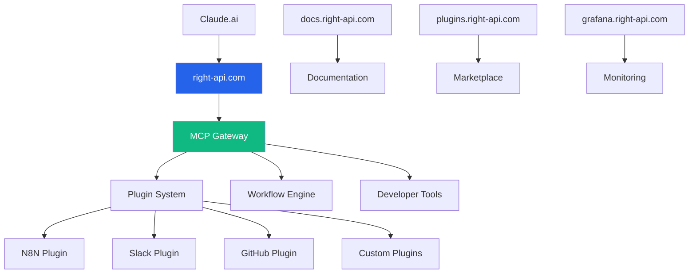

# 🚀 Right API - MCP Gateway Deployment Guide

## **Perfect Domain Fit: right-api.com**

Your **right-api.com** domain is **ideal** for this MCP Gateway project because:

### **🎯 Brand Alignment**
- **"Right API"** = The correct/proper API gateway
- **Developer-focused** branding matches the target audience  
- **Authority positioning** in the API integration space
- **Memorable and professional** domain name

### **🌐 URL Structure**
```
https://right-api.com              # Main gateway & web UI
https://right-api.com/mcp          # MCP protocol endpoint for Claude.ai
https://right-api.com/api          # REST API for developers
https://docs.right-api.com         # Documentation site
https://plugins.right-api.com      # Plugin marketplace
https://grafana.right-api.com      # Monitoring dashboards
```

## **🚀 Quick Deployment to right-api.com**

### **1. Server Setup**
```bash
# SSH to your server
ssh root@your-server-ip

# Clone the project
git clone https://github.com/your-repo/universal-mcp-gateway.git
cd universal-mcp-gateway

# Point to right-api.com
cp .env.production .env
```

### **2. Domain Configuration**
```bash
# Update DNS records for right-api.com
# A record: right-api.com → your-server-ip
# CNAME: www.right-api.com → right-api.com
# CNAME: docs.right-api.com → right-api.com
# CNAME: plugins.right-api.com → right-api.com
# CNAME: grafana.right-api.com → right-api.com
```

### **3. Environment Setup**
```bash
# Set production secrets
export JWT_SECRET=$(openssl rand -hex 32)
export SESSION_SECRET=$(openssl rand -hex 32)
export DB_PASSWORD=$(openssl rand -hex 16)
export REDIS_PASSWORD=$(openssl rand -hex 16)
export ACME_EMAIL=admin@right-api.com

# Create .env file
cat > .env << EOF
JWT_SECRET=${JWT_SECRET}
SESSION_SECRET=${SESSION_SECRET}
DB_PASSWORD=${DB_PASSWORD}
REDIS_PASSWORD=${REDIS_PASSWORD}
ACME_EMAIL=${ACME_EMAIL}
GRAFANA_PASSWORD=admin123
TRAEFIK_AUTH=admin:$(openssl passwd -apr1 admin123)
EOF
```

### **4. Deploy with Docker**
```bash
# Deploy the full stack
docker-compose -f docker-compose.right-api.yml up -d

# Check status
docker-compose -f docker-compose.right-api.yml ps

# View logs
docker-compose -f docker-compose.right-api.yml logs -f right-api-gateway
```

### **5. Verify Deployment**
```bash
# Health check
curl https://right-api.com/health

# MCP endpoint test
curl -X POST https://right-api.com/mcp \
  -H "Content-Type: application/json" \
  -d '{"jsonrpc":"2.0","method":"initialize","id":1}'

# API documentation
curl https://right-api.com/.well-known/mcp-gateway
```

## **🔧 Right API Branding Configuration**

### **Custom Branding**
```typescript
// src/config/branding.ts
export const rightApiBranding = {
  name: "Right API",
  tagline: "The right gateway for Claude.ai integrations",
  domain: "right-api.com",
  logo: "/static/right-api-logo.svg",
  colors: {
    primary: "#2563eb",
    secondary: "#10b981",
    accent: "#f59e0b"
  },
  social: {
    github: "https://github.com/right-api",
    twitter: "https://twitter.com/rightapi",
    discord: "https://discord.gg/rightapi"
  }
};
```

### **Marketing Positioning**
```markdown
# Right API - The Developer's Choice

## Taglines:
- "The right API gateway for Claude.ai"
- "Finally, the right way to connect backends to AI"
- "Right API, right integrations, right away"
- "Get API integrations right the first time"

## Key Messages:
- Developer-first approach
- No vendor lock-in (self-hosted)
- Plugin ecosystem for any backend
- Visual workflow builder
- Production-ready from day one
```

## **📊 Right API Architecture**



## **🎯 Go-to-Market Strategy for Right API**

### **Phase 1: Developer Community (Month 1-3)**
```markdown
Target: Individual developers & small teams
Channel: GitHub, Dev Twitter, Reddit
Message: "Open-source alternative to enterprise MCP solutions"
Offer: Free self-hosted, community plugins
```

### **Phase 2: SaaS Option (Month 4-6)**
```markdown
Target: Teams who don't want to self-host
Channel: Product Hunt, developer conferences
Message: "Managed Right API with zero maintenance"
Offer: right-api.com hosted service with premium plugins
```

### **Phase 3: Enterprise (Month 7-12)**
```markdown
Target: Large companies needing compliance
Channel: Sales, partnerships with MCPAuth/Syncado
Message: "Enterprise-ready with audit logs and SSO"
Offer: On-premise + cloud hybrid deployments
```

## **💰 Monetization Strategy**

### **Open Core Model**
```
Free (Self-Hosted):
✅ Core gateway functionality
✅ Basic plugins (N8N, Slack, GitHub)
✅ Community support

Pro ($29/month):
🚀 Managed hosting at right-api.com
🚀 Premium plugins (Salesforce, HubSpot)
🚀 Advanced workflow features
🚀 Email support

Enterprise ($299/month):
🏢 On-premise deployment
🏢 SSO integration
🏢 Audit logs
🏢 Custom plugin development
🏢 Priority support
```

## **🔗 Integration Examples**

### **Claude.ai Setup**
```json
{
  "name": "Right API Gateway",
  "url": "https://right-api.com/mcp",
  "type": "http",
  "headers": {
    "X-Gateway-Token": "your-token-here"
  }
}
```

### **Workflow Example**
```typescript
// Slack message → N8N workflow → GitHub issue
const workflow = {
  name: "Support Ticket Automation",
  trigger: {
    backend: "slack",
    tool: "on_message",
    config: { channel: "#support" }
  },
  actions: [
    {
      backend: "n8n", 
      tool: "execute_workflow",
      config: { id: "support-triage" }
    },
    {
      backend: "github",
      tool: "create_issue",
      config: { 
        repo: "company/support",
        title: "{{slack.message}}",
        labels: ["support", "auto-created"]
      }
    }
  ]
};
```

## **📈 Success Metrics**

```
Developer Adoption:
- GitHub stars: Target 1k in 6 months
- Plugin downloads: Target 10k/month
- Community size: Target 500 Discord members

Business Metrics:
- Self-hosted deployments: Target 100 companies
- SaaS signups: Target 50 paying customers
- Revenue: Target $50k ARR in year 1
```

## **🚀 Next Steps**

1. **Deploy to right-api.com** using the provided configuration
2. **Set up monitoring** with Grafana dashboards
3. **Create first plugins** for popular services
4. **Launch on GitHub** with comprehensive README
5. **Build community** through Discord and developer forums

Your **right-api.com** domain perfectly positions this as the **developer's choice** for MCP gateway solutions!
